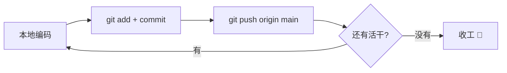
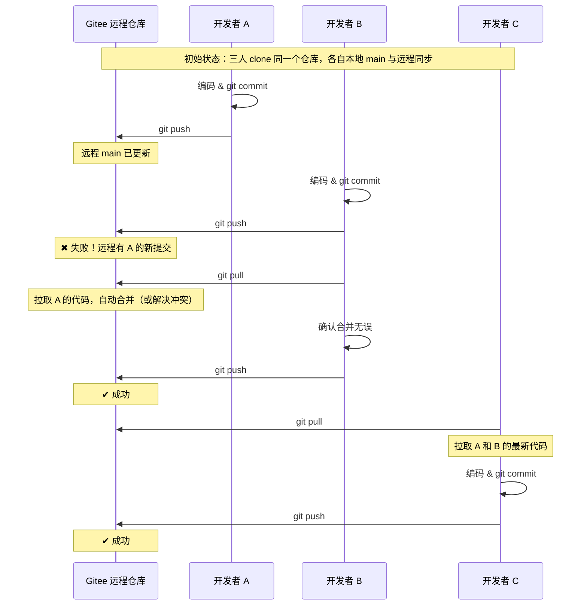

# Gitee 团队协作流程

## 单人开发模式

一个人做一个项目，不需要分支，不需要 PR，所有代码直接往 `main` 推。



### 日常三板斧

```bash
# 第一次：clone 到本地
git clone git@gitee.com:你的用户名/项目名.git
cd 项目名

# 之后每次改完代码：
git add .
git commit -m "feat: 新增xxx功能"
git push origin main
```

### 换电脑 / 换目录继续开发

```bash
# 先把远程最新代码拉下来
git pull origin main

# 改完再推
git add .
git commit -m "fix: 修复xxx问题"
git push origin main
```

> 💡 单人开发虽然简单，但**commit 要勤**，别攒一大堆改了一天才提交一次，出了问题很难回溯。

---

## 协作模式概述

Gitee 上有两种主要的团队协作模式：

| 模式 | 说明 | 适用场景 |
|------|------|----------|
| **共享仓库模式** | 所有成员都有仓库的 push 权限 | 小团队、信任的成员 |
| **Fork + PR 模式** | 成员 Fork 仓库，通过 Pull Request 合并代码 | 开源项目、大团队、代码审核 |

---

## 模式一：共享仓库模式（推荐小团队）

### 分支策略

```
master      ← 生产环境代码，始终保持稳定
  └── dev   ← 开发分支，日常开发在此进行
       ├── feature/login    ← 功能分支
       ├── feature/user     ← 功能分支
       └── fix/bug-123      ← 修复分支
```

### 日常工作流程

```bash
# 1. 从 dev 分支创建功能分支
git checkout dev
git pull origin dev
git checkout -b feature/login

# 2. 开发并提交
git add .
git commit -m "feat(login): 实现登录功能"

# 3. 推送功能分支到远程
git push origin feature/login

# 4. 在 Gitee 上创建 Pull Request（功能分支 → dev）
#    填写 PR 描述，指定审核人

# 5. 审核通过后合并，删除远程功能分支
#    可在 Gitee 网页上操作，也可以命令行：
git checkout dev
git pull origin dev
git branch -d feature/login
```

### 保持分支同步

```bash
# 在功能分支上同步 dev 的最新代码
git checkout feature/login
git rebase dev

# 或者使用 merge（会产生合并提交）
git merge dev
```

---

## 模式二：Fork + PR 模式

### 操作流程

```bash
# 1. 在 Gitee 上 Fork 目标仓库到自己的账号下

# 2. Clone 自己 Fork 的仓库到本地
git clone git@gitee.com:你的用户名/项目名.git
cd 项目名

# 3. 添加原始仓库为 upstream（上游）
git remote add upstream git@gitee.com:原作者/项目名.git

# 4. 验证 remote 配置
git remote -v
# origin    git@gitee.com:你的用户名/项目名.git (fetch)
# origin    git@gitee.com:你的用户名/项目名.git (push)
# upstream  git@gitee.com:原作者/项目名.git (fetch)
# upstream  git@gitee.com:原作者/项目名.git (push)
```

### 日常开发流程

```bash
# 1. 同步上游最新代码
git fetch upstream
git checkout master
git merge upstream/master

# 2. 创建功能分支
git checkout -b feature/新功能

# 3. 开发提交
git add .
git commit -m "feat: 新功能实现"

# 4. 推送到自己的 Fork
git push origin feature/新功能

# 5. 在 Gitee 上创建 Pull Request
#    从 你的用户名/项目名:feature/新功能
#    到 原作者/项目名:master

# 6. 等待审核、修改、合并
```

### 保持 Fork 同步

```bash
# 方式一：命令行
git fetch upstream
git checkout master
git merge upstream/master
git push origin master

# 方式二：Gitee 网页上点击「同步」按钮（仓库首页右侧）
```

---

## Pull Request（PR）操作指南

### 创建 PR

1. 推送分支后，Gitee 仓库页面会自动提示 **「创建 Pull Request」**
2. 填写标题和描述，说明本次改动的内容
3. 指定审核人（Reviewer）
4. 点击 **「创建 Pull Request」**

### PR 描述模板（推荐）

```markdown
## 改动内容
- 新增了 xxx 功能
- 修复了 xxx 问题

## 影响范围
- 是否涉及数据库变更：否
- 是否涉及 API 变更：否

## 测试情况
- 本地测试通过
- 单元测试已补充

## 关联 Issue
Closes #123
```

### PR 审核要点

+ 代码风格是否一致
+ 逻辑是否正确，有无边界条件遗漏
+ 是否有安全隐患
+ 是否有必要的测试覆盖
+ 提交信息是否规范

---

## Issue 协作

### 创建 Issue

+ 用于报告 Bug、提出需求、讨论方案
+ 标题简洁明确，描述详细
+ 可以添加标签（bug / feature / help wanted）

### 关联 Issue

```bash
# 在 commit 信息中关联
git commit -m "fix(login): 修复登录超时问题

Closes #42"

# 在 PR 描述中关联
# 写上 Closes #42 或 Fixes #42
# PR 合并后 Issue 会自动关闭
```

---

## 代码冲突解决

### 什么是冲突

当两个人修改了同一个文件的同一段代码，Git 无法自动合并，就会产生冲突。

### 冲突的表现

```
<<<<<<< HEAD
你的代码
=======
别人的代码
>>>>>>> feature/other
```

### 解决步骤

```bash
# 1. 拉取最新代码
git pull origin dev

# 2. 如果有冲突，Git 会提示冲突文件
#    打开冲突文件，找到 <<<<<<< 标记

# 3. 手动选择保留哪部分代码（或合并两部分）
#    删除 <<<<<<< ======= >>>>>>> 标记

# 4. 标记为已解决
git add .

# 5. 提交合并
git commit -m "merge: 解决合并冲突"

# 6. 推送
git push origin dev
```

### 预防冲突

+ 经常 `git pull` 同步远程代码
+ 功能分支生命周期尽量短
+ 不同人尽量改不同文件
+ 提交前先 rebase 最新代码

---

## 提交规范（Conventional Commits）

团队协作时，统一的提交格式能让代码历史更清晰：

```
<type>(<scope>): <描述>

[可选的正文]

[可选的脚注]
```

### 常用 type

| type | 说明 |
|------|------|
| `feat` | 新功能 |
| `fix` | 修复 Bug |
| `docs` | 文档修改 |
| `style` | 代码格式（不影响功能） |
| `refactor` | 重构（既不修复 Bug 也不添加功能） |
| `test` | 添加或修改测试 |
| `chore` | 构建过程或辅助工具变动 |

### 示例

```bash
git commit -m "feat(login): 添加微信扫码登录"
git commit -m "fix(api): 修复分页参数越界问题"
git commit -m "docs(readme): 更新部署文档"
```

---

## 小团队直推 main 分支流程

几个人的小项目，不需要分支策略和 PR 审核，所有人都直接在 `main` 分支上开发，通过 push/pull 协调。



### 核心规则

```bash
# 改完代码，提交前先拉取最新
git pull origin main

# 有冲突就解决，没问题就直接推
git push origin main
```

> ⚠️ **push 失败是常态**——说明别人先推了，`git pull` 拉下来合并后再推就行，不要 `--force`。

---

## Fork + PR 协作流程图

```mermaid --> B[创建功能分支\nfeature/xxx]
    B --> C[编码 & 本地提交]
    C --> D{代码是否完成?}
    D -- 未完成 --> C
    D -- 完成 --> E[push 到远程]
    E --> F[创建 Pull Request]
    F --> G[代码审核 Review]
    G --> H{审核是否通过?}
    H -- 需要修改 --> I[根据反馈修改代码]
    I --> C
    H -- 通过 --> J[合并到主分支]
    J --> K[删除功能分支]
    K --> L{还有新需求?}
    L -- 有 --> B
    L -- 无 --> M[完成 🎉]
```

---

## 参考说明

> 本文部分内容参考：[Gitee 帮助文档](https://gitee.com/help)
